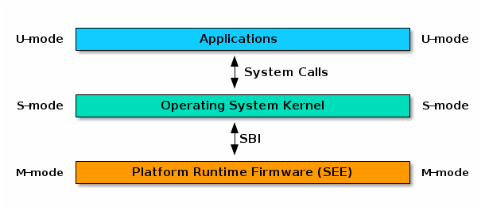

# SBI support

Up to now, we only have access to the CPU itself (and haven't managed to print `Hello, World!`). In this section, we will talk about how SBI helps us to do basic interactions with the platform.

## About SBI

Supervisor Binary Interface (SBI) provides us with a limited but out-of-box interface for interacting with the platform. As you all know, RISC-V has several privileged execution levels, and our OS runs in the middle: Supervisor (S)-mode. Firmware, on the other hand, runs on the Machine (M)-mode, and is responsible for backing up all platform-specific setups. SBI is the protocol that firmware uses to serve us, similar to syscall but at a lower abstraction level.



We will not cover the tedious [calling specification](https://github.com/riscv-non-isa/riscv-sbi-doc/blob/master/riscv-sbi.adoc) here, and provide a macro that just does the job:

File: src/macros.rs
```rust
macro_rules! sbi_call {

    // v0.1
    ( $eid: expr; $($args: expr),* ) => { sbi_call!($eid, 0; $($args),*).0 };

    // v0.2
    ( $eid: expr, $fid: expr; $($arg0: expr $(, $arg1: expr )?)? ) => {
        {
            let (err, ret): (usize, usize);
            unsafe {
                core::arch::asm!("ecall",
                    in("a7") $eid, lateout("a0") err,
                    in("a6") $fid, lateout("a1") ret,

                  $(in("a0") $arg0, $(in("a1") $arg1)?)?
                );
            }

            (err, ret)
        }
    };
}
```

Built on that, now the machine can power off gracefully. (Remember the simulator halts everytime? Now it terminates itself!)

File: src/sbi.rs
```rust
pub fn shutdown() -> ! {
    sbi_call!(0x08;);
    unreachable!()
}
```

## Kernel output

Time to write our own output using the above SBI calls! Our own implementation of the `Write` trait will be used by `core::fmt` to output formatted string:

File: src/sbi/console.rs
```rust
pub struct Kout;
impl core::fmt::Write for Kout {
    fn write_str(&mut self, string: &str) -> core::fmt::Result {
        for char in string.chars() {
            sbi_call!(0x01; char as usize);
        }
        Ok(())
    }
}
```

File: src/macros.rs
```rust
macro_rules! kprint {
    ($($arg:tt)*) => {{
        use core::fmt::Write;
        drop(write!($crate::sbi::Kout, $($arg)*));
    }};
}

macro_rules! kprintln {
    () => { kprint("\n") };
    ($($arg:tt)*) => {
        kprint!($($arg)*);
        kprint!("\n");
    };
}
```

Putting them all together, let's say hello to the world and then gracefully shut down the machine:

File: src/main.rs
```rust
#[macro_use]
mod macros;

mod mem;
mod sbi;

#[no_mangle]
fn main() -> ! {
    kprintln!("Hello, World!");
    sbi::shutdown()
}

```
