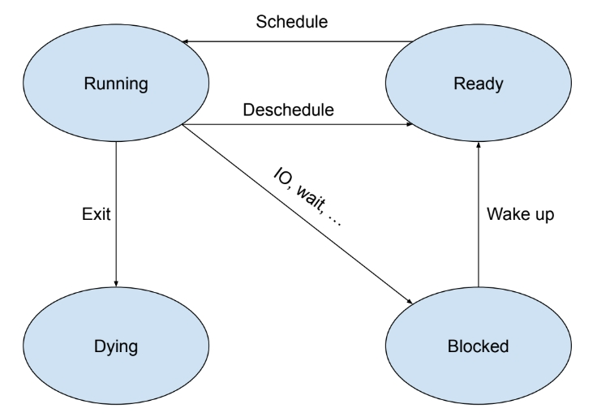

# Enable time sharing

Follow the instructions in the previous section, you are able to create kernel threads. In order to run them, we must support thread shceduling -- it enables a thread to yield the CPU to another one. Again, let's begin from the simplest step: support thread scheduling on a non-preemptive CPU (which means every thread will not be interrupted. It continues running until it yields explicitly by calling `schedule()`). Therefore, we need to support following APIs:

```Rust
/// Get the current running thread
pub fn current() -> Arc<Thread> { ... }

/// Yield the control to another thread (if there's another one ready to run).
pub fn schedule() { ... }

/// Gracefully shut down the current thread, and schedule another one.
pub fn exit() -> ! { ... }
```

`Schedule` trait is designed to support the schedule process. In this part, we will also write a FIFO scheduler that implements the `Schedule` trait. Understand it may be helpful to your project!

## States of a kernel thread

Now consider there are multiple threads inside the kernel. Those threads are in different states. At a given time, a thread can be in one of four states: `Running`, `Ready`, `Blocked` and `Dying`. `Running` simply means the thread is running (As the OS is running on a single-core processor, there is only one `Running` thread at any given time). A thread in `Ready` state is ready to be scheduled. `Blocked` threads are blocked for different reasons(e.g. IO, wait for another thread to terminate, etc. It is complex, so we are not covering it in this section). `Dying` is a little bit tricky, we label a thread as `Dying` to release its resources in the (hopefully near) future. The state transitions are illustrated in the followin graph.



Those states can be found in:

```rust
// src/kernel/thread/imp.rs
/// States of a thread's life cycle
#[derive(Debug, Clone, Copy, PartialEq, Eq)]
pub enum Status {
    /// Not running but ready to run
    Ready,
    /// Currently running
    Running,
    /// Waiting for an event to trigger
    Blocked,
    /// About to be destroyed
    Dying,
}
```

And a `Thread` struct contains a `status` field. It is also inside a `Mutex` beacuse it is mutable.

```Rust
// src/kernel/thread/imp.rs
#[repr(C)]
pub struct Thread {
    tid: isize,
    name: &'static str,
    stack: usize,
    status: Mutex<Status>,
    context: Mutex<Context>,
    ...
}

impl Thread {
    ...
    pub fn status(&self) -> Status {
        *self.status.lock()
    }

    pub fn set_status(&self, status: Status) {
        *self.status.lock() = status;
    }
    ...
}
```

## Support the `current` function

Because at any given time, only one thread could be in `Running` state. Therefore, the easiest way is to record it in the `Manager` struct. The `current` function could thus be implemented:

```Rust
// src/kernel/thread/manager.rs
/// Global thread manager, contains a scheduler and a current thread.
pub struct Manager {
    /// The current running thread
    pub current: Mutex<Arc<Thread>>,
    /// All alive and not yet destroyed threads
    all: Mutex<VecDeque<Arc<Thread>>>,
}

// src/kernel/thread.rs
/// Get the current running thread
pub fn current() -> Arc<Thread> {
    Manager::get().current.lock().clone()
}
```

## The `Schedule` trait and the FIFO `Scheduler`

When a thread yields, the OS is responsible to select another ready thread and schedule it. Many algorithms can achieve this. Therefore, we designed the `Schedule` trait to standardize it.

```Rust
// src/kernel/thread/scheduler.rs
/// Basic thread scheduler functionalities.
pub trait Schedule: Default {
    /// Notify the scheduler that a thread is able to run. Then, this thread
    /// becomes a candidate of [`schedule`](Schedule::schedule).
    fn register(&mut self, thread: Arc<Thread>);

    /// Choose the next thread to run. `None` if scheduler decides to keep running
    /// the current thread.
    fn schedule(&mut self) -> Option<Arc<Thread>>;
}
```

The `Schedule` trait looks nice, but how to use it? In fact, we added a new field, `scheduler` in the `Manager` struct, who will use `scheduler` to select from the thread candidates, and record the ready threads. For example, when a new thread is created, its default state is `Ready`. So the `Manager` will call `scheduler` to register it into the scheduler.

```Rust
// src/kernel/thread/manager.rs
/// Global thread manager, contains a scheduler and a current thread.
pub struct Manager {
    /// Global thread scheduler
    pub scheduler: Mutex<Scheduler>,
    /// The current running thread
    pub current: Mutex<Arc<Thread>>,
    /// All alive and not yet destroyed threads
    all: Mutex<VecDeque<Arc<Thread>>>,
}

impl Manager {
    /// Get the singleton.
    pub fn get() -> &'static Self { ... }

    pub fn register(&self, thread: Arc<Thread>) {
        // Register it into the scheduler
        self.scheduler.lock().register(thread.clone());

        // Store it in all list.
        self.all.lock().push_back(thread.clone());
    }
}
```

Implement a scheduler is easy (at least for FIFO scheduler):

```Rust
// src/kernel/thread/scheduler/fcfs.rs
/// FIFO scheduler.
#[derive(Default)]
pub struct Fcfs(VecDeque<Arc<Thread>>);

impl Schedule for Fcfs {
    fn register(&mut self, thread: Arc<Thread>) {
        self.0.push_front(thread)
    }

    fn schedule(&mut self) -> Option<Arc<Thread>> {
        self.0.pop_back()
    }
}
```

To use the FIFO scheduler, we need to create a type alias:

```Rust
// src/kernel/thread/scheduler.rs
pub type Scheduler = self::fcfs::Fcfs;
```

The `Schedule` trait allows us to separate the logic of context switching and selecting candidate execution threads. `Manager` only uses `Schedule` trait, if you want to use another scheduler, all you need to do is to create another struct, implement `Schedule` trait, and set the type as `Scheduler`. Isn't it exciting?

## Support `schedule` function based on `Schedule` trait

Now we are writing the `schedule` function. Suppose there are two kernel threads, T1 and T2. T1 calls `schedule()`, and the scheduler choose T2 to run. Basically, schedule must:

* store callee-saved register values on T1's context (we needn't store caller saved values, because they have already saved on previos stack frame)
* load T2'2 register values from T2's context (including load T2's sp)
* transfer control to T2's PC
* update information in `Manager`

Following graph shows the `sp` before & after the schedule.

```
      Before schedule       After schedule
     ┌──────────────┐      ┌──────────────┐
     │      ...     │      │      ...     │
     ├──────────────┤      ├──────────────┤
sp-> │  T1's stack  │      │  T1's stack  │
     ├──────────────┤      ├──────────────┤
     │      ...     │      │      ...     │
     ├──────────────┤      ├──────────────┤
     │  T2's stack  │  sp->│  T2's stack  │
     ├──────────────┤      ├──────────────┤
     │      ...     │      │      ...     │
     └──────────────┘      └──────────────┘
```

We divided the `schedule` function into 3 steps:

1. Use scheduler to find another runnable thread
2. Do context switching
3. Do some finishing touches, like register the previous thread to the scheduler, ...

The first and third step needs to modify the `Manager` or the `Scheduler`, therefore they are implemented as a method of `Manager`. The second step has to be written in assembly. Let's start from the first step:

```Rust
// src/kernel/thread/manager.rs
impl Manager {
    ...
    pub fn schedule(&self) {
        let next = self.scheduler.lock().schedule();

        if let Some(next) = next {
            assert_eq!(next.status(), Status::Ready);
            next.set_status(Status::Running);

            // Update the current thread to the next running thread
            let previous = mem::replace(self.current.lock().deref_mut(), next);

            // Retrieve the raw pointers of two threads' context
            let old_ctx = previous.context();
            let new_ctx = self.current.lock().context();

            // WARNING: This function call may not return, so don't expect any value to be dropped.
            unsafe { switch::switch(Arc::into_raw(previous).cast(), old_ctx, new_ctx) }

            // Back to this location (which `ra` points to), indicating that another thread
            // has yielded its control or simply exited. Also, it means now the running
            // thread has been shceudled for more than one time, otherwise it would return
            // to `kernel_thread_entry` (See `create` where the initial context is set).
        }
    }
}
```

The first step is done in `Manager::schedule` function. We first find another runnable thread. If success, we marked it as `Running`, put it inside the `current` field, and then call `switch` to do context switching. The `switch` function takes 3 arguments: an pointer to the previous thread, and the `old_ctx` and `new_ctx`. `old_ctx` and `new_ctx` are preserved context in previous and current `Thread` struct.

The next step is in the `switch` funtion. `switch` is written in riscv asm, and we prepared a signiture for it in rust extern "C", in order to force it to stick to the C calling convention (a0~a7 are arguments, ...):

```Rust
// src/kernel/thread/switch.rs
#[allow(improper_ctypes)]
extern "C" {
    /// Save current registers in old. Load from new.
    ///
    /// The first argument is not used in this function, but it
    /// will be forwarded to [`schedule_tail_wrapper`].
    pub fn switch(previous: *const Thread, old: *mut Context, new: *mut Context);
}

global_asm! {r#"
    .section .text
        .globl switch
    switch:
        sd ra, 0x0(a1)
        ld ra, 0x0(a2)
        sd sp, 0x8(a1)
        ld sp, 0x8(a2)
        sd  s0, 0x10(a1)
        ld  s0, 0x10(a2)
        sd  s1, 0x18(a1)
        ld  s1, 0x18(a2)
        sd  s2, 0x20(a1)
        ld  s2, 0x20(a2)
        sd  s3, 0x28(a1)
        ld  s3, 0x28(a2)
        sd  s4, 0x30(a1)
        ld  s4, 0x30(a2)
        sd  s5, 0x38(a1)
        ld  s5, 0x38(a2)
        sd  s6, 0x40(a1)
        ld  s6, 0x40(a2)
        sd  s7, 0x48(a1)
        ld  s7, 0x48(a2)
        sd  s8, 0x50(a1)
        ld  s8, 0x50(a2)
        sd  s9, 0x58(a1)
        ld  s9, 0x58(a2)
        sd s10, 0x60(a1)
        ld s10, 0x60(a2)
        sd s11, 0x68(a1)
        ld s11, 0x68(a2)

        j schedule_tail_wrapper
"#}

/// A thin wrapper over [`thread::Manager::schedule_tail`]
///
/// Note: Stack is not properly built in [`switch`]. Therefore,
/// this function should never be inlined.
#[no_mangle]
#[inline(never)]
extern "C" fn schedule_tail_wrapper(previous: *const Thread) {
    Manager::get().schedule_tail(unsafe { Arc::from_raw(previous) });
}
```

`old` is the previous thread's context, we will write to it; `new` is the next thread's context, we will read from it. The `switch` function changes the runtime stack. Then we jump to the `schedule_tail_wrapper`, where we call the `Manager::schedule_tail`, finish the `schedule` procedure:

```Rust
// src/kernel/thread/manager.rs
impl Manager {
    /// Note: This function is running on the stack of the new thread.
    pub fn schedule_tail(&self, previous: Arc<Thread>) {
        match previous.status() {
            Status::Dying => {
                // A thread's resources should be released at this point
                self.all.lock().retain(|t| t.id() != previous.id());
            }
            Status::Running => {
                previous.set_status(Status::Ready);
                self.scheduler.lock().register(previous);
            }
            Status::Blocked => {}
            Status::Ready => unreachable!(),
        }
    }
}
```

We will do different work, depending on the status of the previous thread. Let's focus on the `Running` and `Ready` cases (we will come back to `Dying` when discuss the `exit` funtion, and discuss `Blocked` in further future). The previous thread's status is `Ready` is a unreachable case, beacuse it is read from the `current` field in the `Manager`, so it should not be `ready`. Previous thread's status is `Running` indicates it yields the CPU, then we shall put it back into the scheduler.

After `schedule_tail` finishes, we have already done everything needed to switch to another thread. Then `schedule_tail` should return to `schedule_tail_wrapper`, which should return to somewhere in the new thread, and continues to execute it. It actually does so, because we have already modified the `ra` register in `switch` (MAGIC!).

> __Exercise__
>
> In fact, `schedule_tail_wrapper` only returns to two places. Could you find them?

With three functions introduced above, the `schedule` funtion could be implemented in this way:

```Rust
// src/kernel/thread.rs
/// Yield the control to another thread (if there's another one ready to run).
pub fn schedule() {
    Manager::get().schedule()
}
```

## Support `exit` function

In `schedule_tail`, the status matches `Dying` means the previous function is exited. Therefore, in the `exit` function, all we need to do is to set the status to `Dying`, and then schedule another funtion.

```Rust
// src/kernel/thread.rs
/// Gracefully shut down the current thread, and schedule another one.
pub fn exit() -> ! {
    {
        let current = Manager::get().current.lock();
        current.set_status(Status::Dying);
    }

    schedule();

    unreachable!("An exited thread shouldn't be scheduled again");
}
```

> __Exercise__
>
> Why do we need another block before calling `schedule`? If we delete the "{" and "}" inside the function, what will happen?
